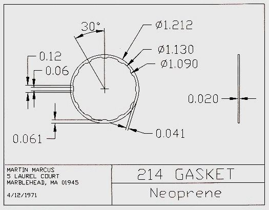
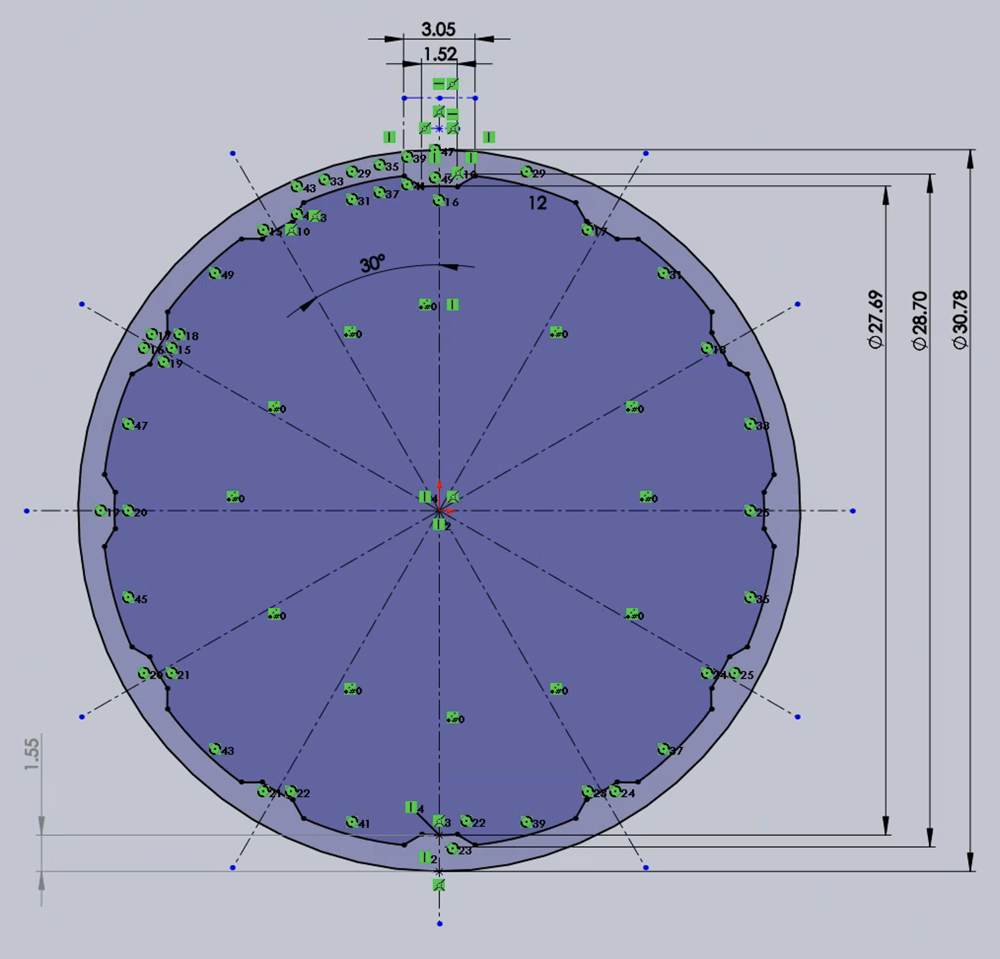
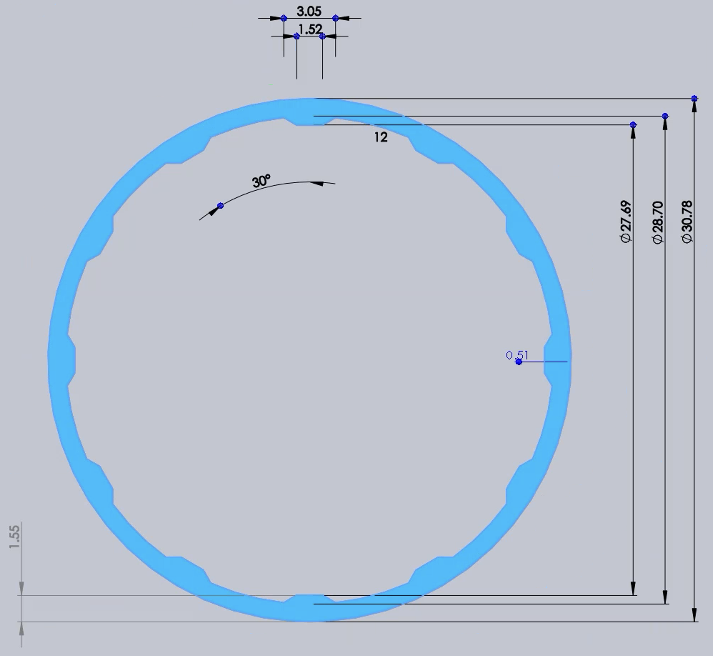

<a href="../">Back to Index</a>
# Accutron 214 Gasket 
This is an original drawing based on the dimensions from [Martin Marcus' 1971 drawing](Files/Accutron 214 Gasket/images/accutron_214_martin_marcus_gasket_drawing.jpg).

## Files available:
- [SLDPRT](files/Accutron%20214%20Gasket.SLDPRT) (Solidworks 2021 Part File)
- [STEP](files/Accutron%20214%20Gasket.STEP) (AP 14)
- [STL](files/Accutron%20214%20Gasket.STL) (Binary, MM)
- [DXF](files/Accutron%20214%20Gasket.DXF)
