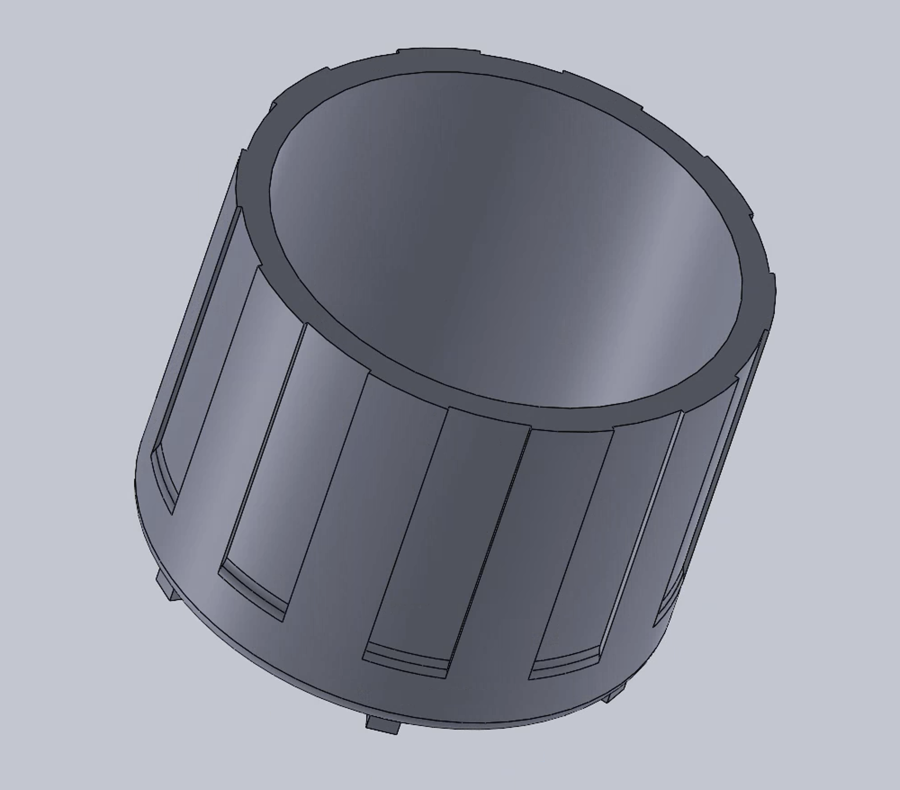
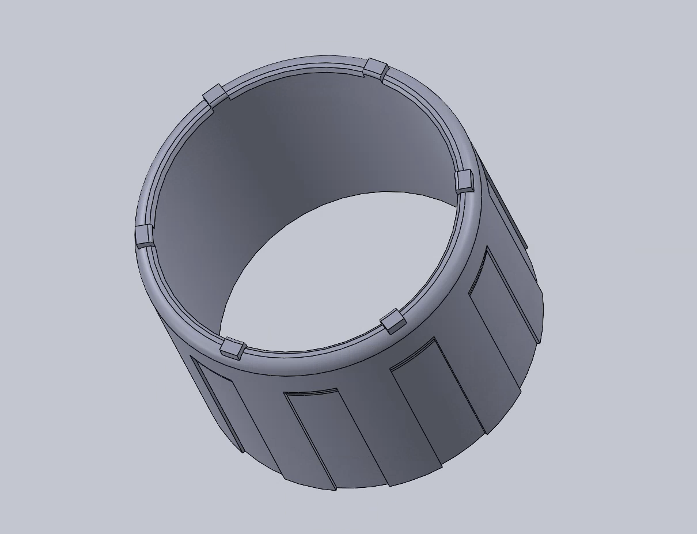
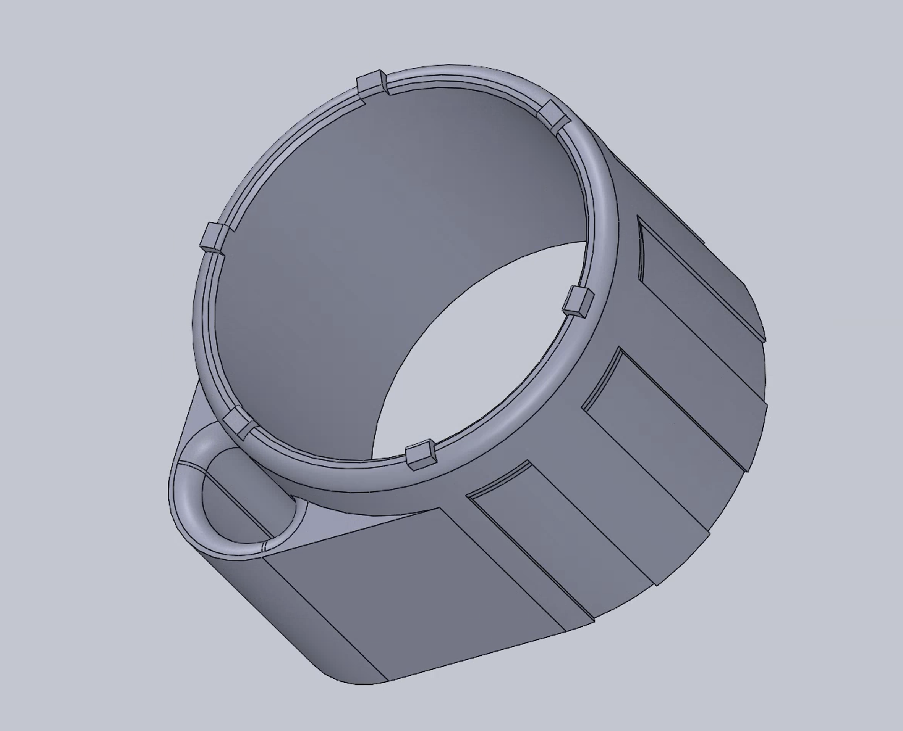
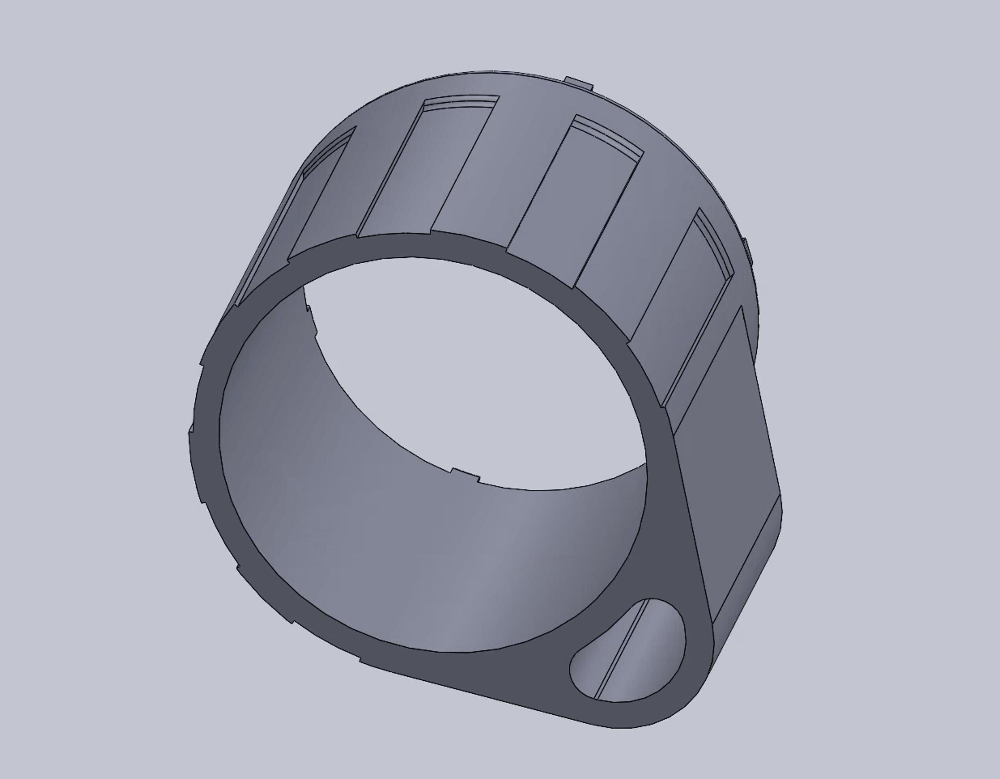

<a href="../">Back to Index</a>
# Accutron 214 Wrench 
This design includes two variations — a plain cylindrical wrench and a "thumb wrench" with an extra torque lever. 

## Files available:
Wrench: 
- [SLDPRT](files/Accutron%20214%20Wrench.SLDPRT) (Solidworks 2021 Part File)
- [STEP](files/Accutron%20214%20Wrench.STL) (AP 14)
- [STL](files/Accutron%20214%20Wrench.STEP) (Binary, MM)

Thumb Wrench:
- [SLDPRT](files/Accutron%20214%20Thumb%20Wrench.SLDPRT) (Solidworks 2021 Part File)
- [STEP](files/Accutron%20214%20Thumb%20Wrench.STEP) (AP 14)
- [STL](files/Accutron%20214%20Thumb%20Wrench.STL) (Binary, MM)
